<h1 align="center">Historical Landmarks Website</h1>

## Description

Historical Landmarks is informative website about that gives brief history on wellknown landmarks across the global. From the year it was build and its purpose. This site has multiple images of famous landmarks, embedded google map, a video showing 100 historical famous and form page to sign up to the site. 

The site is live and can access [here](https://krandon1986.github.io/project-1-htlm-css/index.html) 

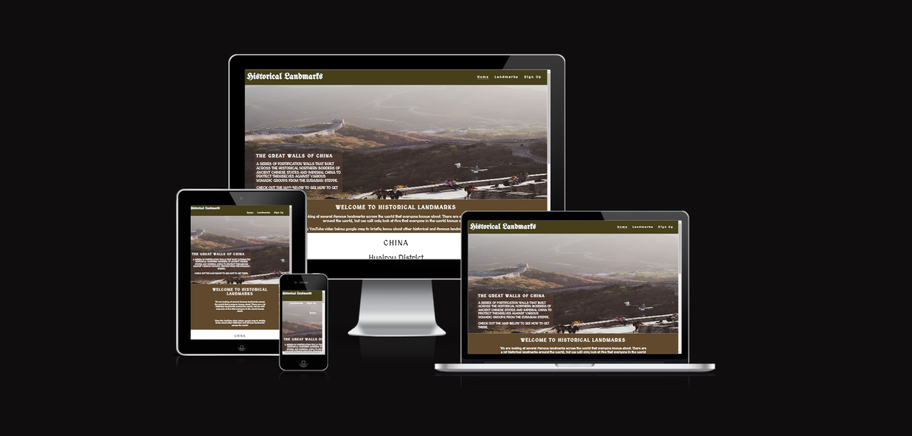

## Design

- __Color Pallete__
    - The two main colors that are used are Olive Drab 7 and Dark Brown.
    - Oliver Drab is used as the base color for the header and footer of the pages.
    - Dark Brown is used for each section that will go back to back with Olive Drab.
    - Both colors are compatible to the historical theme of this site according to the icolorpalette website.

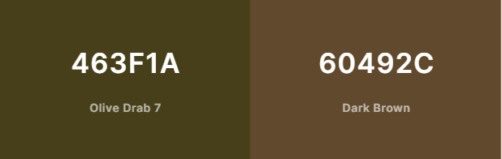

- __Typography__
    - The Unifraktur Maguntia google font will be used for the website header logo, with san serif font being a fallback.
    - The Medieval Sharp font will be used for the body and pair perfectly with Unifraktur as both fonts have a historical theme to them.
    - As with Unifraktur Maguntia, san serif will be fallback font. 

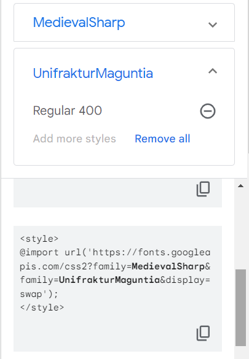

- __Wireframe__
    - Desktop Wireframe
        - Structure the layout of the site to a desktop format.

    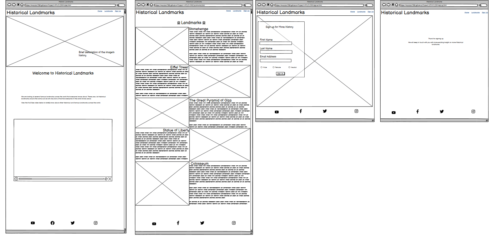
    
    - Mobile Wireframe
        - Struture the layout of the site to a smaller display screen.
    .png) 

## Feature
Features on that have been implemented on the website will be introduced in this section. The function of each feature will be explained such as how to crossfade an image to another image. 

- __Navigation Bar__ 

    - This section contains the main title (logo) and page menu where three main pages can be accessed from.
    - The site logo can be used to take you to the home page as it linked to it. However, the home page can accessed from "Home" link.
    - Having a page menu at top of the every page is considered good practice for users to easily navigate through the website. 
    
     

- __Hero Image__ 

    - At top of the home page, but below the page menu, there is a hero image of the Great Walls of China. When you refresh the home page, you can witness the hero image being zoomed in.
    - On the hero image, there is a cover text of the left-hand side showing a brief history on the Great Walls of China. The background color of the cover-text is transparent to 0.5 opacity. 

    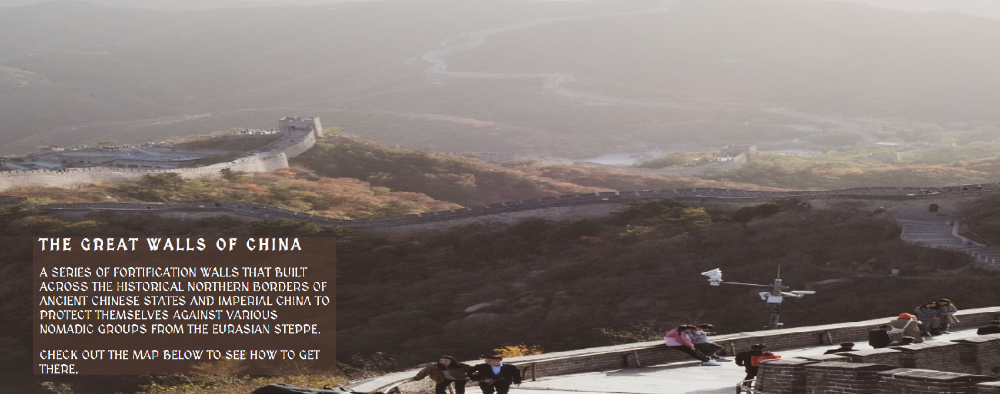 

- __Website Intro and Google Map__

    - This section serves as an introduction to the site, highlighting what the website is about.
    - Below this section is an embedded Google map that show location of the Great Walls of China. It gives the area when the historical landmark can be found. 

    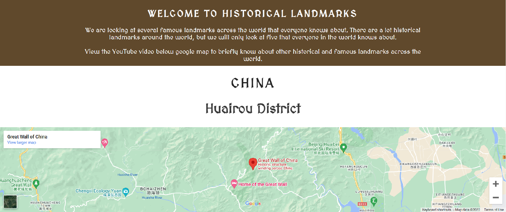

- __Embedded YouTube Video__ 
    
    - This section contain an embedded YouTube video of 100 famous landmarks across the world.
    - On the desktop display, the video will be display on the left while the video's description is displayed on the right.
    - Looking through the section through smartphone, video description will be displayed above the YouTube video. 
    - 

    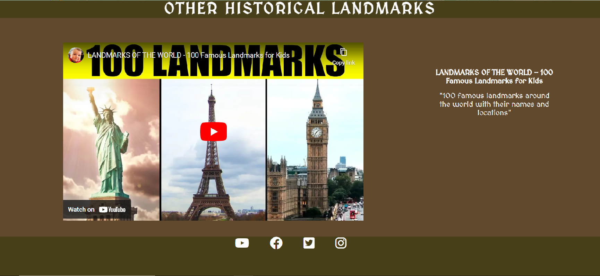

- __Footer__

    - The Footer section contain several link social media sites like YouTube, FaceBook, Twitter and Instagram.
    - The four icons that is linked to its' corresponding social media is copied from Font Awesome site.

    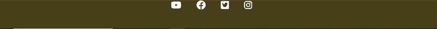

- __Landmarks Page__

    -  Heading
        - Onto the Landmark page, one icon from the Font Awesome site is placed either side of the "Landmark" heading. 
    
    

    - Crossfading Image
       
        - The five section on this page, dividing into two column. The landmark of the left and the landmarks's desciption on the right, and vice verse on the section section.
        - The images of the landmarks have a crossfading feature to it that changes the image whenever the mouse hover over the image. The two overlapping images are the same landmark, but from a different position and different times 

    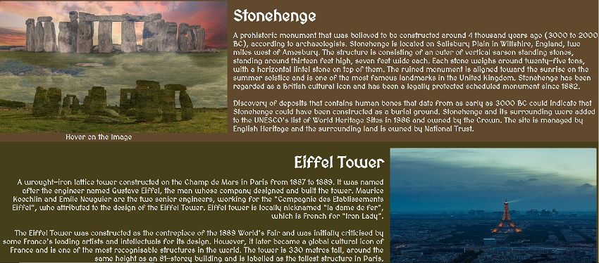
    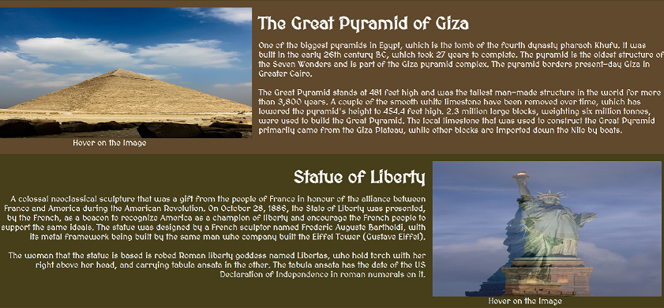
    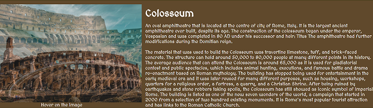

- __Sign Up__
   
    - In this page, it will allow the user to enter their full name, email address and their gender so they can sign up. 
    - The form is transparent, along with the input field and the user can't submit the form if the field is empty.
    - The image of someone's hand signing a piece of paper is placed as the background image of the form section.  

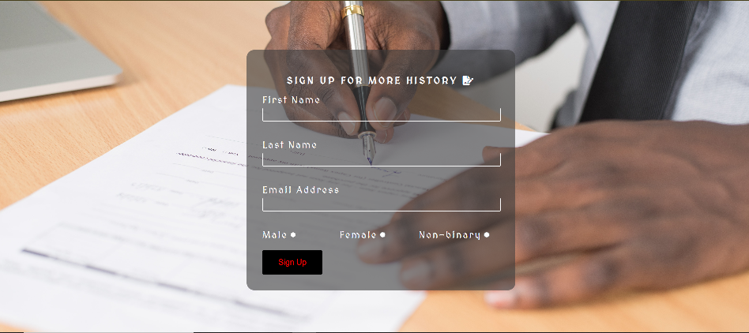

- __Thank You__
    - When the user fill in the form and presses the sign up button, they are taken to a thank you page after their details have been recieved. 
    - On the thank you page, a message is displayed, thanking the users to signing up. 

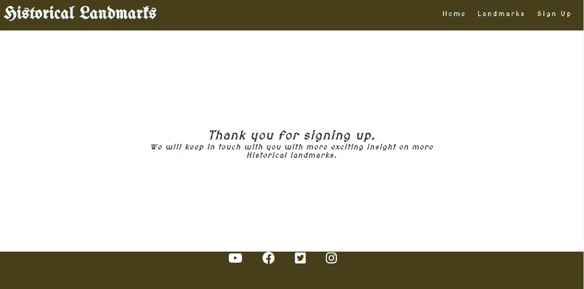

## Testing

- HTML Validator
    - No errors were shown after HTML code was passing through [W3C validator](https://validator.w3.org/nu/?showsource=yes&doc=https%3A%2F%2Fkrandon1986.github.io%2Fproject-1-htlm-css%2Findex.html)

- CSS Validator
    - No errors was found when passing the CSS code through [(Jigsaw) validator](https://jigsaw.w3.org/css-validator/validator?uri=https%3A%2F%2Fkrandon1986.github.io%2Fproject-1-htlm-css%2F&profile=css3svg&usermedium=all&warning=1&vextwarning=&lang=en)

- Accessibility
    - The sign-up page score minimum of 98% due to background and foreground color not having a sufficent contract ratio. 
    - The thank-you page also score minimum of 98% due to the heading elements not being in sequentially descending order. 
    - All the other pages (Home and Landmarks) are 100%. 

        - Home

            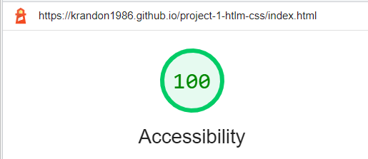

        - Landmarks

            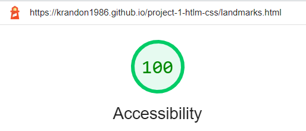

        - Sign Up

            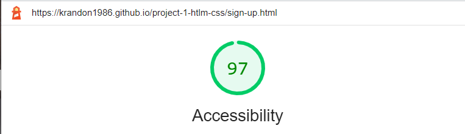

        - Thank You

            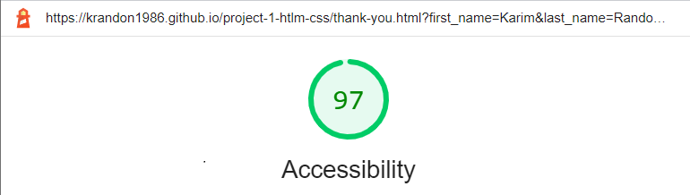

- Mobile Responsiveness
  - Maximum screen width for responsive design was done at 950px.   
  - Mobile responsiveness was limited to the "toggle device" feature in Chrome Developer Tools due to lack of access to more physical devices.

### Bugs

There was no knowmn bug identified during the final deployment time.

## Deployment

This Historical Landmark site was deployed on GitHub page.

- Here are following steps to deploy your site:
    - In your GitHid repository, click the 'setting' tab.
    - Look at the left menu and select 'Pages'
    - In the source section drop-down menu, select the 'Main Branch' and click 'Save'
    - After a successful save, the GitHub section will display a message to inform you that the site is ready to be published at https://krandon1986.github.io/project-1-htlm-css/ 

## Credits 
The following section indentifies websites that supported me build my Historical Landmarks site.

### Contents

- General Guidance
  - [Font](https://fonts.google.com/) 
  - [Crossfading](http://css3.bradshawenterprises.com/cfimg/)
  - [Color Pallettes](https://icolorpalette.com/palette-by-themes/history)
  - [Wireframes](https://balsamiq.com/)
  - [Icons](https://fontawesome.com/)
  - [Pointer](https://www.w3schools.com/cssref/pr_class_cursor.php)
  - [Images](https://www.pexels.com/)
  - [Div](https://blog.hubspot.com/website/center-div-css#:~:text=With%20CSS%2C%20you%20can%20center,content%20and%20align%2Ditems%20properties.)

 