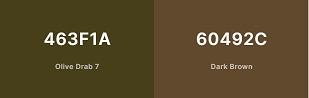

<h1 align="center">Historical Landmarks Website</h1>

## Description

Historical Landmarks is informative website about that gives brief history on wellknown landmarks across the global. From the year it was build and its purpose. This site has multiple images of famous landmarks, embedded google map, a video showing 100 historical famous and form page to sign up to the site. 

The site is live and can access [here](https://krandon1986.github.io/project-1-htlm-css/index.html) 

## Design

- __Color Pallete__
    - The two main colors that are used are Olive Drab 7 and Dark Brown.
    - Oliver Drab is used as the base color for the header and footer of the pages.
    - Dark Brown is used for each section that will go back to back with Olive Drab.
    - Both colors are compatible to the historical theme of this site according to the icolorpalette website.

- __Typography__
    - The Unifraktur Maguntia google font will be used for the website header logo, with san serif font being a fallback.
    - The Medieval Sharp font will be used for the body and pair perfectly with Unifraktur as both fonts have a historical theme to them.
    - As with Unifraktur Maguntia, san serif will be fallback font. 

- __Wireframe__
    - Desktop Wireframe
        - Structure the layout of the site to a desktop format.

    
    
    - Mobile Wireframe
        - Struture the layout of the site to a smaller display screen.
    .png) 

    
 